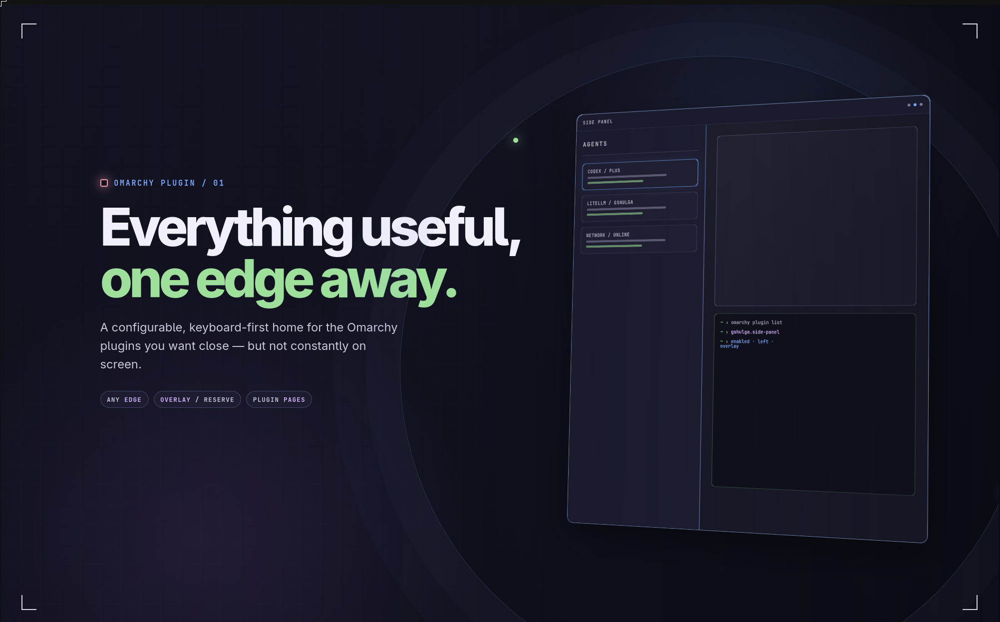
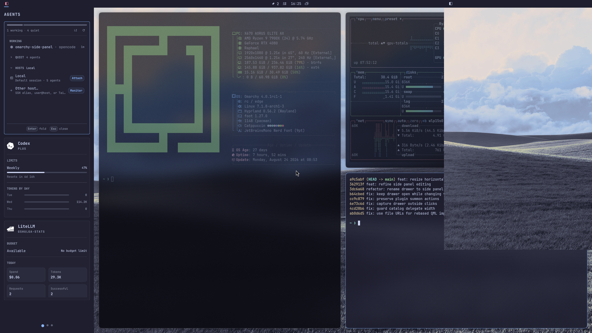
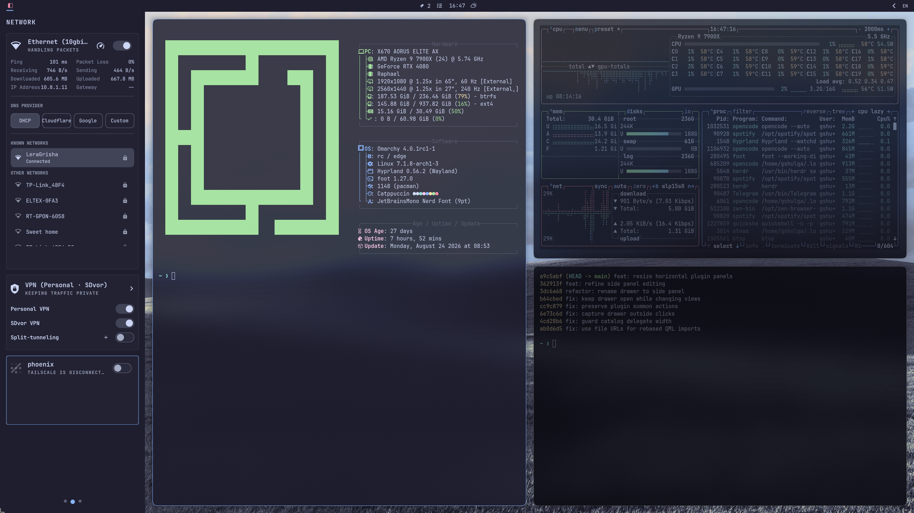
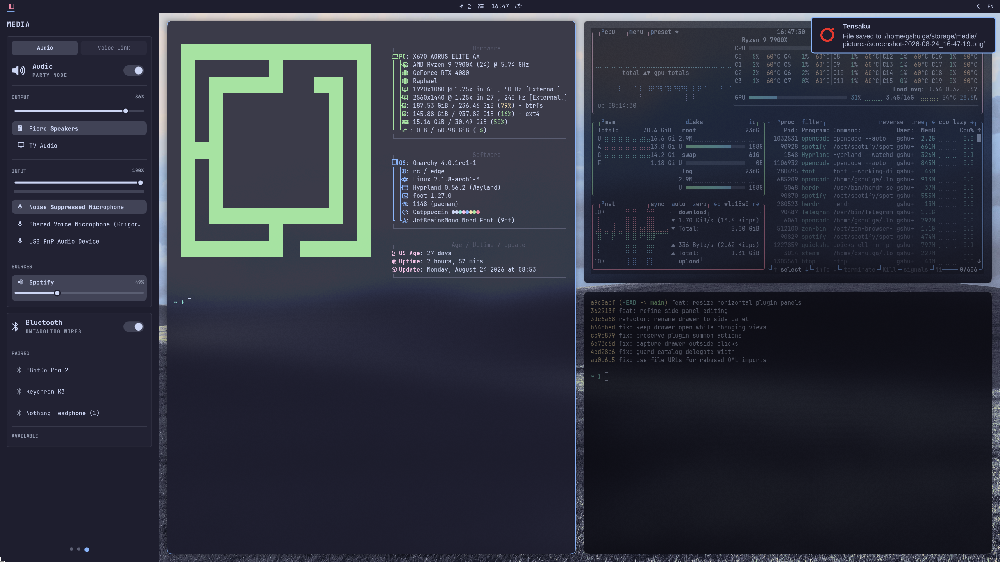
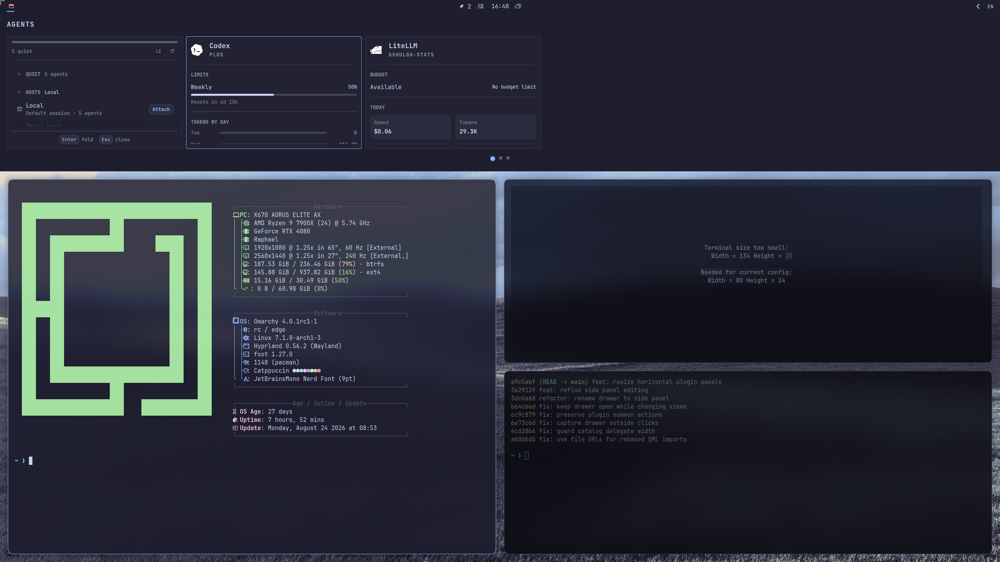
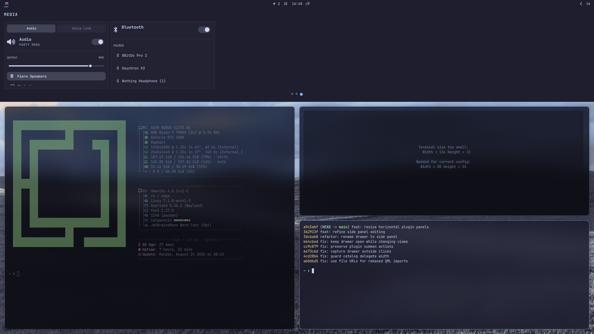
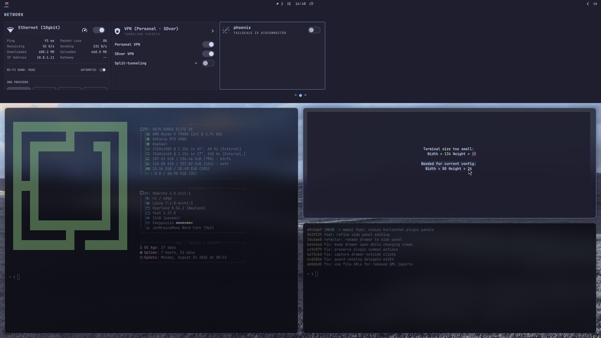
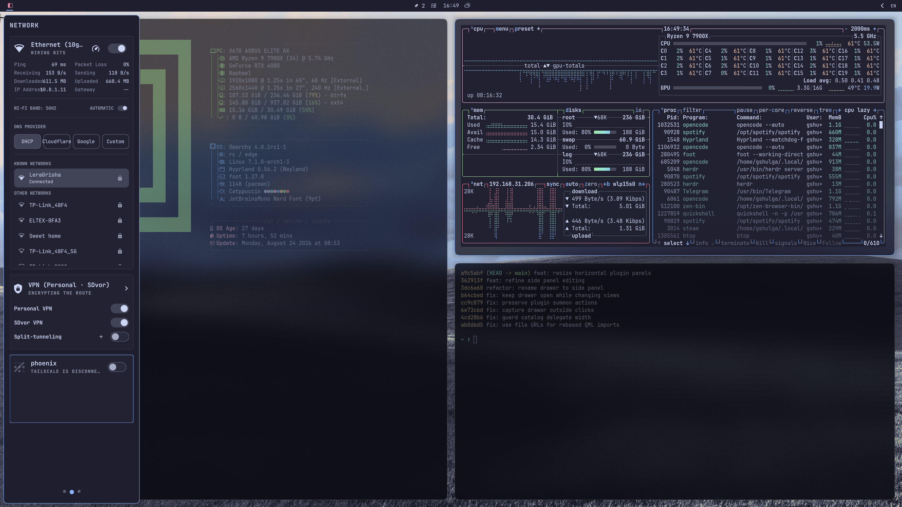
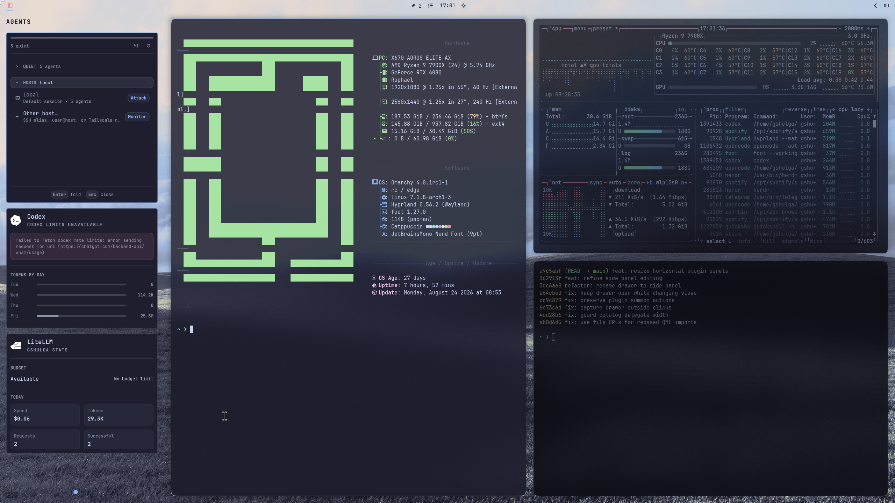

# Omarchy Side Panel

<p align="center">
  
</p>

`omarchy-side-panel` is an edge side panel for secondary Omarchy plugins. It keeps one
bar icon and exposes a reorderable, collapsible plugin list from the configured
left, right, top, or bottom screen edge.

## Why a side panel?

A side panel is the home for plugins that are convenient to keep at hand but do
not need to be on screen at all times. They stay one action away instead of
permanently occupying workspace.

The opposite workflow works just as well: pin the panel and keep it open while
you work. It becomes a dedicated strip for information you want to watch, such as
token budgets, agent progress, or any other live data from the plugins you run —
all the operationally relevant details stay within reach.

## Features

- Place the panel on any screen edge: left, right, top, or bottom.
- Two display modes: `overlay` (floats above windows) and `reserve` (reserves
  its edge, so Hyprland lays out normal windows in the remaining space).
- Pin the panel so it stays open when another bar popout is activated.
- Organize plugins into several pages.
- Resize every plugin panel individually.
- Keyboard-centric controls.
- Optional transparent background to keep the interface light.

## Preview

Side Panel keeps related Omarchy pages in one keyboard-navigable surface while
leaving the current workspace visible.

| Left: agents | Left: network |
| --- | --- |
|  |  |

| Left: media | Top: agents |
| --- | --- |
|  |  |

| Top: media | Top: network |
| --- | --- |
|  |  |

| Overlay mode | Transparent background |
| --- | --- |
|  |  |

## Compatibility

An existing Omarchy `bar-widget` cannot be embedded safely just by loading its
entry-point QML. Most widgets own a `KeyboardPanel` anchored to their own bar
button, assume bar-managed lifecycle, and may be instantiated once per output.
Forcing that QML into another container breaks those assumptions.

Side Panel therefore has three explicit modes:

- **Automatic standard-panel embedding:** when a plugin uses Omarchy's standard
  `KeyboardPanel`, Side Panel copies the plugin into an immutable, fingerprinted
  cache entry under `$XDG_CACHE_HOME/omarchy-side-panel/`, replaces the one host
  with `SidePanelHost`, and replaces copied IPC handlers and bar buttons with
  inert local shims. The installed plugin and Omarchy files are never changed.
- **Explicit embedded page:** a plugin may opt in with `entryPoints.sidePanelPage`.
  Side Panel loads that component directly and supplies optional `sidePanel`, `bar`,
  `settings`, `pluginId`, and `service` properties.
- **Native fallback:** a listed plugin without `sidePanelPage` remains usable when
  it exposes an enabled native panel.
  Side Panel shows an `Open native panel` action and calls Omarchy's normal
  `shell.summon(id)` route. The target plugin must remain enabled.

Standard panels are embedded without source changes. The explicit page route
remains the stable option for plugin authors, while the native fallback covers
custom windows that cannot be reparented under Wayland.

## Install

```bash
omarchy plugin add https://github.com/gshulga/omarchy-side-panel.git --enable
```

Omarchy discovers the plugin as `gshulga.side-panel`. Add it to the bar as usual if
the installer does not place it automatically.

The repository URL above assumes the public GitHub repository will be named
`gshulga/omarchy-side-panel`. If you choose a different owner or repository name,
replace the URL in this command.

## Requirements and security

- Omarchy with the Quattro plugin runtime and the `omarchy plugin` command.
- Python 3 for automatic standard-panel embedding. The adapter uses only the
  Python standard library; no packages, network access, or elevated privileges
  are required.
- A running Omarchy shell. Side Panel is a `bar-widget` plugin and does not
  start a second Quickshell process or a background service.

Like other Omarchy plugins, Side Panel runs unsandboxed with the current user's
permissions. Review the plugins you add to its list before embedding them. The
automatic adapter reads an installed plugin, writes a disposable transformed
copy below `$XDG_CACHE_HOME/omarchy-side-panel/` (or the platform cache
fallback), and never modifies the installed plugin source. Side Panel stores its
layout/state through Omarchy settings and under the user's XDG state directory.

## Remove

```bash
omarchy plugin remove gshulga.side-panel
```

Removal does not require `sudo` and does not remove other plugins. The generated
adapter cache is disposable; remove `$XDG_CACHE_HOME/omarchy-side-panel/` only if
you want to reclaim it after uninstalling.

## Configuration

The edge is available in the Omarchy plugin settings. The vertical plugin list
is kept as plain data in the Side Panel layout entry in
`~/.config/omarchy/shell.json`:

```json
{
  "id": "gshulga.side-panel",
  "edge": "left",
  "plugins": [
    { "id": "gshulga.jira", "label": "Jira", "icon": "\\ue75c" },
    { "id": "io.github.sotoaugusto.ticktick", "label": "Tasks", "icon": "\\uf0ae" },
    { "id": "omarchy.network", "label": "Network", "icon": "\\uf1eb" },
    { "id": "omarchy.bluetooth", "label": "Bluetooth", "icon": "\\uf293" }
  ]
}
```

`Side Panel layout` controls how the compositor treats the open side panel:

- `overlay`: Side Panel floats over existing windows.
- `reserve`: Side Panel reserves its edge width or height, so Hyprland lays out
  normal windows in the remaining screen area.

When `plugins` is omitted, Side Panel starts empty.
Existing `pages` configuration is flattened into the list the first time its
order or membership is changed.

Selecting `Embed in Side Panel` persists `"embedding": "standard"` on that list
item. Side Panel regenerates the disposable adapted copy from the current plugin
source on a later open, including after a shell or plugin update.

## Plugin List

- Side Panel normally shows plugin panels only, without per-plugin headers.
- Click `EDIT` to show plugin headers and editing controls. Click `DONE` to
  return to the panel-only view.
- Click `PIN` to keep Side Panel open when another bar popout is activated. Click
  `UNPIN` or the Side Panel bar icon to close it.
- In edit mode, drag any free area of a plugin header to reorder it. Use the
  trash button to remove a plugin. A highlighted line previews the insertion
  position.
- Drag a plugin panel's lower edge on left/right Side Panels, or its right edge
  on top/bottom Side Panels, to resize it in 5px steps. The visible grip on the
  Side Panel's outer edge resizes the Side Panel itself.
- In edit mode, click `+` to see every installed Omarchy plugin not already in
  the list, then add one immediately. Disabled plugins are identified in that
  catalog; their native fallback requires enabling them in Omarchy first.

## Embedded Page Contract

To expose a plugin page inside Side Panel, add this entry point to its manifest:

```json
"entryPoints": {
  "barWidget": "BarWidget.qml",
  "sidePanelPage": "SidePanelPage.qml"
}
```

`SidePanelPage.qml` must be an ordinary `Item` or control that sizes to its parent.
It must not create a `PanelWindow`, manage an overlay, or depend on a bar-icon
anchor. The preferred contract is one optional initialization method:

```qml
function initializeSidePanel(context) {
  // context.sidePanel, context.sidePanelItem, context.bar, context.settings,
  // context.pluginId, and context.service
}
```

Otherwise, the side panel injects these optional writable
properties when they exist:

- `sidePanel`: the Side Panel host, including `close()`.
- `bar`: the active Omarchy bar object.
- `sidePanelItem`: Side Panel-specific list metadata.
- `settings`: the selected plugin's native Omarchy settings, when available.
- `pluginId`: the selected plugin id.
- `service`: the plugin's singleton service, if it has one.

Example:

```qml
import QtQuick

Item {
  property var sidePanel: null
  property var service: null

  Text {
    anchors.centerIn: parent
    text: "My embedded plugin page"
  }
}
```

## Keyboard Controls

- `Escape`: close the side panel.
- `Escape` while the add catalog is open: close the catalog.
- `Ctrl+Tab`: focus the next embedded plugin panel.
- `Ctrl+Shift+Tab`: focus the previous embedded plugin panel.
- `Alt+Right` / `Alt+Left`: next / previous Side Panel page.
- `Alt+Scroll Up` / `Alt+Scroll Down`: next / previous Side Panel page.
- Once a panel is focused, its keyboard controls, including arrow-key navigation,
  receive input directly.

## Automatic Embedding

Press `Embed in Side Panel` for an enabled listed plugin. Side Panel tries the standard
adapter before it offers native fallback. It supports both conventional Omarchy
shapes:

- a `barWidget` entry point whose QML contains `KeyboardPanel`;
- a `barWidget` entry point that loads a sibling `Panel.qml` containing
  `KeyboardPanel`.

The adapter uses a generated immutable cache copy. On the next Side Panel open it
rebuilds the copy from installed source when that source changes, so a plugin
update is picked up automatically. It rejects a plugin that creates its own
`PanelWindow`, overlay, or non-standard popup host: Wayland windows cannot be
reparented into another QML item after creation. Those plugins retain native
fallback only when Omarchy can summon them.

See `docs/automatic-embedding.md` for the transformation contract and safety
boundaries.

## Development

Validate the manifest and run the tests from the repository root:

```bash
omarchy plugin validate .
python3 -m unittest discover -s tests -p 'test_*.py'
qmltestrunner -input tests/qml -import .
```

The QML tests require the Omarchy shell's QML imports to be installed. The
repository does not include an installer, third-party dependencies, telemetry,
remote build steps, or external services.

## License

MIT. See [LICENSE](LICENSE).
