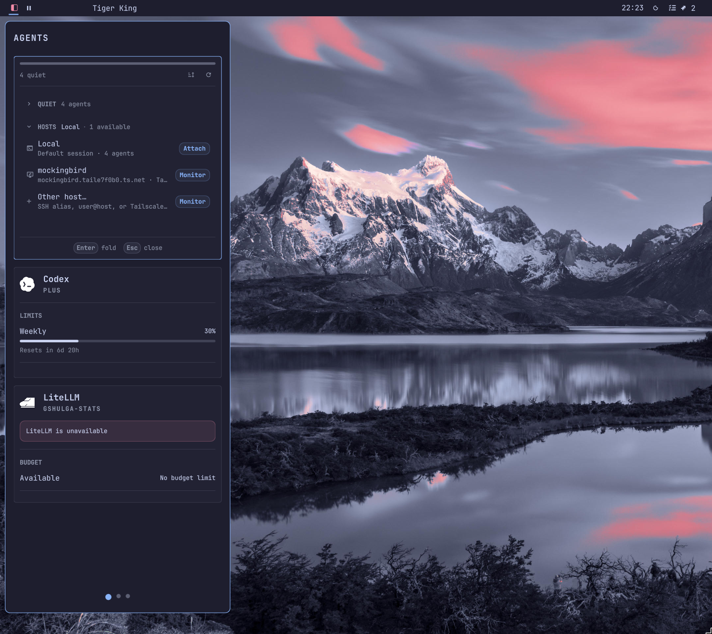
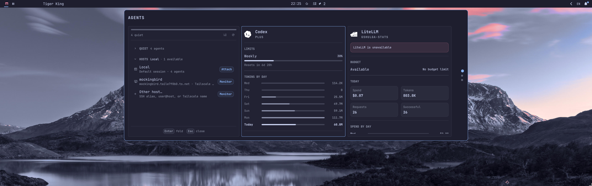

# Omarchy Side Panel

<p align="center">
  
</p>

Omarchy Side Panel is a configurable edge surface for the plugin panels you use
most. Organize them into named Side Panel pages, open the surface from the bar
or its screen edge, and keep the workspace clear when you do not need it.

## Requirements

- Omarchy with plugin support and a running Omarchy shell.
- Python 3 for automatic embedding of supported standard panels. No third-party
  Python packages are required.

## Install

```bash
omarchy plugin add https://github.com/grigoryshulga/omarchy-side-panel.git --enable
```

The plugin id is `gshulga.side-panel`. If its icon is not visible after
installation, add **Side Panel** in Omarchy's bar-plugin settings.

To remove it:

```bash
omarchy plugin remove gshulga.side-panel
```

## Get started

1. Select the Side Panel icon in the bar.
2. Hover the current Side Panel page title and choose **Edit**.
3. Choose **Add Plugin**, then select an installed plugin for the current page.
   Side Panel enables the plugin when necessary.
4. Choose **Done** to leave Edit mode.

Hover the page title to reveal the pencil, then click it (or use `Alt + R`) to
rename the current Side Panel page. Create and remove pages in Edit mode; a
Side Panel always retains at least one page.

## Using the Side Panel

- Hover the title to reveal **? Shortcuts**, **Settings**, **Edit**, and **Pin**.
  The action name expands on hover.
- **Pin** keeps the Side Panel visible when focus changes, you click outside it,
  or press `Escape`. Pinning lasts only until the Side Panel is closed.
- Without Pin, changing focus or clicking outside closes the Side Panel.
- In Edit mode, select a Side Panel item to focus it. Drag item headers to
  reorder items, use the item controls to expand or remove them, and drag their
  grips to resize them.
- The ordinary mouse wheel scrolls the hovered plugin panel. Hold `Alt` while
  scrolling in either wheel direction to move between Side Panel pages.

### Settings

The Settings page provides these controls:

- **Edge**: left, right, top, or bottom.
- **Display mode**: **Overlay** floats over windows; **Reserve Space** reserves
  edge space so windows use the remainder.
- **Overlay alignment**: on a left or right Edge, align the Side Panel to the
  top, center, or bottom; on a top or bottom Edge, align it to the left, center,
  or right.
- **Resize Panel**: enables the resize grips. Overlay has grips for both axes;
  Reserve Space exposes only the grip that changes the Side Panel's edge extent.
- **Reveal at screen edge**: opens the Side Panel when the pointer rests at its
  configured Edge. It is enabled by default.
- **Delay**: the pointer dwell time before edge reveal, from 0 to 2000 ms. The
  default is 250 ms.

Omarchy's plugin settings also offer a transparent Side Panel background.

## Keyboard shortcuts

Select **? Shortcuts** in the Side Panel for this reference at any time.

| Shortcut | Action |
| --- | --- |
| `Escape` | Close the add-plugin catalog, Settings, or shortcut help; otherwise close an unpinned Side Panel. |
| `Alt + ?` | Open or close shortcut help. |
| `Alt + S` | Open or close Settings. |
| `Alt + P` | Pin or unpin the Side Panel. |
| `Alt + E` | Enter or leave Edit mode. |
| `Alt + R` | Rename the current Side Panel page. |
| `Alt + 1` … `Alt + 9` | Switch to a numbered Side Panel page. |
| `Alt + Left` / `Alt + Right` | Previous or next Side Panel page outside Edit mode. |
| `Ctrl + Tab` / `Ctrl + Shift + Tab` | Focus the next or previous Side Panel item. |

In Edit mode:

| Shortcut | Action |
| --- | --- |
| `Alt + C` | Create a Side Panel page. |
| `Alt + X` | Remove the current Side Panel page. |
| `Alt + +` | Add a plugin. |
| `Alt + -` | Remove the focused Side Panel item. |
| `Alt + Space` | Expand or collapse the focused item. |
| `Alt + Up` / `Alt + Down`, `Alt + K` / `Alt + J` | Move the focused item on a left or right Edge. |
| `Alt + Left` / `Alt + Right`, `Alt + H` / `Alt + L` | Move the focused item on a top or bottom Edge. |
| `Alt + Ctrl + Up` / `Alt + Ctrl + Down`, `Alt + Ctrl + K` / `Alt + Ctrl + J` | Resize focused item height on a left or right Edge. |
| `Alt + Ctrl + Left` / `Alt + Ctrl + Right`, `Alt + Ctrl + H` / `Alt + Ctrl + L` | Resize focused item width on a top or bottom Edge. |

When an embedded page has Panel focus, its own keyboard controls receive input.

## Plugin compatibility

Side Panel chooses the safest available integration for every selected plugin:

1. A plugin with an explicit `sidePanelPage` is loaded as an embedded page.
2. A supported conventional Omarchy `KeyboardPanel` is copied to a disposable
   cache and adapted for the Side Panel.
3. If embedding is unavailable, Side Panel can open the enabled plugin's native
   panel instead.

The automatic copy lives under `$XDG_CACHE_HOME/omarchy-side-panel/` and never
changes the installed plugin. It is safe to delete after uninstalling Side Panel
or when reclaiming disk space.

Side Panel starts the current Side Panel page first, then warms the remaining
embedded pages incrementally. Once loaded, embedded pages remain available until
the Side Panel closes, avoiding reloads while switching pages or windows.

## Limits and data

Side Panel permits up to 12 Side Panel pages, 24 items per page, and 48 items
in total. These limits keep persistent layout work and plugin loading bounded.

Its configuration is maintained by Omarchy. Saved state is bounded and stored
under the XDG state directory. Side Panel is an unsandboxed plugin running with
your user permissions, so add only plugins you trust.

## For plugin authors

An explicit embedded page is the preferred integration. Add a `sidePanelPage`
entry point alongside the existing bar widget:

```json
"entryPoints": {
  "barWidget": "BarWidget.qml",
  "sidePanelPage": "SidePanelPage.qml"
}
```

`SidePanelPage.qml` must be an ordinary `Item` or control that fills its parent.
It must not create a `PanelWindow`, manage an overlay, or depend on a bar-icon
anchor. Side Panel supplies `sidePanel`, `sidePanelItem`, `bar`, `settings`,
`pluginId`, and `service` when matching writable properties exist. Alternatively,
provide `initializeSidePanel(context)` to receive these values together.

```qml
import QtQuick

Item {
  property var service: null

  function initializeSidePanel(context) {
    service = context.service
  }
}
```

For supported automatic-embedding shapes, transformation rules, and safety
boundaries, see [Automatic embedding](docs/automatic-embedding.md).

## Preview

| Overlay on the left edge | Overlay on the top edge |
| --- | --- |
|  |  |

| Overlay mode | Transparent background |
| --- | --- |
|  |  |

## Development

Run these checks from the repository root:

```bash
omarchy plugin validate .
python3 -m unittest discover -s tests -p 'test_*.py'
bash tests/adapter-smoke.sh
qmltestrunner -input tests/qml -import .
```

The QML suite requires Omarchy's QML imports and a graphical session.

## License

[MIT](LICENSE)
